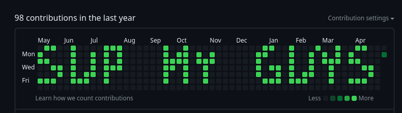
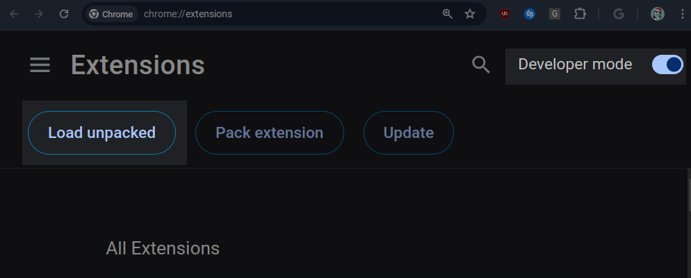
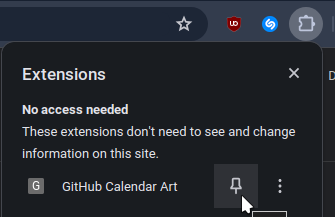

# GitHub Contribution Calendar Art!



Draw tf out on the world's best canvas - GitHub Contribution Calendar (because why not).

## Synopsis

The way this works is fairly straightforward. First, a custom chrome extension is used to inject JavaScript into the GitHub profile page's DOM using a [service worker](https://developer.chrome.com/docs/extensions/develop/concepts/service-workers/), and well, the rest is self-explainatory. 

We get the dimensions of the contribution chart using JS, forward that data to a Flask server, and use python Pillow to resolve any given image into the chart's "coordinates", aka the respective cells.


## Setting Up
> **Disclaimer:** This is only going to work on Chromium based browsers.

- Clone the repo, and install the dependencies:

    ```sh
    git clone https://github.com/BillyDoesDev/github-contrib-cal.git
    cd github-contrib-cal
    pip install -r requirements.txt
    ```
- Start the server.
    ```sh
    usage: python server.py [options] directory_path

    positional arguments:
    directory_path  Path to the directory where your images are

    options:
    -h, --help      show this help message and exit
    --inv           Invert images
    --reload_cache  Disable using cache [generates frames again]

    Version 0.0.1
    ```
    > **NOTE:** The pictures you put inside the directory **MUST BE NAMED LIKE SO: `frame#.png`,** where the `#` is the **frame number**, starting from `1`. This is done to make sure stuff happens in the right order. Should you fail to do this, there might be unwanted/unexpected results.

</br>

- Next, open up your [Chrome extensions page](chrome://extensions/), and enable `Developer mode`, and click on `Load unpacked`.

    

- Pick the current folder this project is in, and you should see a new extension load up - pin it.

    

- Next, navigate to a GitHub profile of your choice, click the extension, and enjoy!

## Keynotes

This was made with love. (Actually no, I'm lying. I was just too bored lol).

Contributions are welcome, I'll add in more features when I have nothing else to do. Peace.